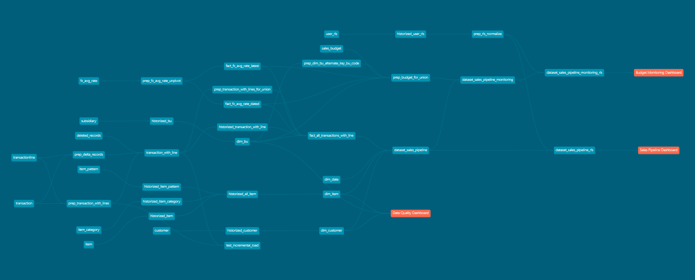

# Technology 

## Installation 
### Prerequisites
- Python must be installed
- A cloud instance of SQL Server Express 2022 is required. The profiles.yml host should be updated accordingly. 
If needed, deployment files for SQL Server Express are available under `deployment > deployment_sqlserver`.
The Docker image provided can be used for localhosting of SQL Server Express. The deployment files on the other hand can be used to deploy SQL Server Express in Kubernetes.
- System variables must be created for SQL Server access locally: `setx SQLSERVER_HOST "XXX.XXX.XX.XX"; setx SQLSERVER_USER "sa"; setx SQLSERVER_PASSWORD "xxxxxxxxxxx"`. A restart of VS Code will be needed for the variables to be visible.
- Makefile must be installed (e.g. via Chocolatey: `choco install make`)

### Required installation
- Python libraries and Dbt: `make install_python_libraries`
- SQL Server ODBC: `make install_sqlserver_odbc`
- SQL Server Management Studio: `make install_ssms`
- GitHub CLI: `make install_github_cli`

### Optional installation
- Docker Desktop: `make install_docker_desktop`

## Commands
### Localhost of SQL Server Express using Docker (Optional)
- Launch Docker (volume, image, run): `make docker_start`
- Stop Docker: `make docker_end`
### Prod set-up
- Launch (or reset) the entire dbt project: `make dbt_prod_hard_reset`
- Reset the entire dbt project except the staging schema (i.e dbt seeds): `make dbt_prod_soft_reset`
### Prod regular run
- Dbt snapshot, run (incremental), tests: `make dbt_prod_run`

Remark: when testing the containerized Dbt project locally with Docker Desktop, the environments variables must be filled with the bash command: `export SQLSERVER_HOST="XXX.XXX.XX.XX"; export SQLSERVER_USER="sa"; export SQLSERVER_PASSWORD="xxxxxxxxxxx"`
Then, it will be possible to execute any action, like `make dbt_prod_run`
### Development branch
- Dbt run using the development branch: `make dbt_run MODEL=...`
- Dbt test using the development branch: `make dbt_test [MODEL=...]`
### Artifacts
- Download from GitHub: `make refresh_artifacts`
### Cleaning
- Delete the development branch schema: `make drop_branch_schema`

# Business context
The client is a company working in the cosmetic industry.
Following a successful implementation of the ERP NetSuite, the CEO wants to construct a BI ecosystem and leverage this new data source.
While NetSuite offers some reporting capabilities, the client is limited with NetSuite alone because:
- Some transformations are impossible to do in NetSuite (e.g. perform several joins throughout the model).
- Some external data should be integrated and cannot be recorded in NetSuite (e.g. budget, custom fx rates).
- Data historization (snapshotting) is impossible in NetSuite.
- BI users are not necessarily NetSuite users:
    - They have a different user journey, and
    - They have different row-level-security requirements.

# Business requirements 
The first use case identified by the client is a monitoring of the sales pipeline, which is defined by the aggregation of invoices, 'open' sales orders and 'open' opportunities in NetSuite. The sales pipeline is basically the estimated landing sales for the year.

The client wants to use the annual budget as a performance objective for the sales and consolidate everything under a dataset which will be connected to a BI dashboard.
The dashboard will show the estimated landing compared to the objective and will enable the managers to monitor the sales team among each business unit, and for each client.

This dashboard should also show the evolution of the sales landing every monthly (i.e. a monthly snapshot of the data). This will help the business evaluate the data reliability and the evolution of the total sales landing throughout the year.

## Data sources
### NetSuite fact transactions
In NetSuite, all transactions (facts) are recorded at two levels:
1. transaction, which can be understood as the document header.
2. transaction_line, which can be understood as the document details.

Some document attributes are defined at a transaction level, while most financial attributes are captured at a transaction_line level.
There is a one-to-many relationship between transaction and transaction_line. 

### NetSuite dimensions
There are several NetSuite dimension that are relevant in the context of the sales pipeline analysis (and more):
- Customer
- Item
- Business Unit (aka. 'Subsidiary' in NetSuite)

### Date dimension
The client has a fiscal calendar that is not starting in january, but in february.
This should be taken into consideration for all fields with time dependency ('current year', 'previous year', etc.)

### Row-level-security (RLS)
Datasets are expected to be restricted to the scope of each authorized user - at a row level.
RLS is provided in the form of an Excel file containing several dimensions to be used for each user email: bu_code, customer_name and item_type.

The security that should be enforced is the intersection of all conditions/dimensions.
However, if another record is provided for the same user email, the two sets of conditions to be additive. This is a rare exception for some users who need to see the data of all their business unit + the data of some of their clients across all business units.

For instance, 
- User1 shoud have access to 2 business units, and all customers and item types inside those two business units.
- User2 shoud have access to:
    - all business units and all item types for the customer 'Nu Smart Global' only, but also
    - 2 business units, and all customers and item types inside those two business units.

| user_email | authorized_bu_code | authorized_customer_name | authorized_item_type |
|----------|----------|----------|----------|
| user1@example.com | AUBU,ATBU | All | All |
| user2@example.com | All | Nu Smart Global | All |
| user2@example.com | AUBU,ATBU | All | All |

Another requirement regarding security is that the RLS set-up history should be accessible at any time, to know which user had access to which scope.

### Budget
To monitor the performance of the sales pipeline, a budget file is provided by the client's finance team in the form of an Excel file. 
Because the data entry is made by the finance team, the budget Excel file matches with some, but not all, of the dimension attributes of NetSuite listed previously. Namely:
- The finance team only provides the customer_name, and the client is aware that no relation will be possible with the NetSuite customer dimension since the join is too fuzzy.
- No budget is recorded at an item level.
- The finance team only provides the bu_code, which is not the expected foreign key to the Business Unit dimension. The expected key is the bu_nsid, but the client says that the bu_code is an acceptable alternative key.

Overall, the consequence is that the budget data will return NULL if non applicable dimension attributes are ever used as filters inside the BI tool. 

### FX rates
The existing NetSuite transactional rate is used to convert foreign amounts to the amounts in business unit currency. However, the client wants to then convert each business unit amount to USD and EUR using an external Excel file provided by the treasury department.

The FX rates file provided by the treasury department is at a year-month level, and the client says that the rate to be used depends on the year-month of the transaction date. If no rate is available at the transaction date, then the latest rate available for the given currency should be used.

The client says that the reporting will always be in USD, but the reporting in EUR currency may change in the future.

## Data processing
### Historization
- The client wants to historize the dimension attributes (SCD Type 2) to be able to track changes and report on both the live/current view and the historical view - at the time of the transaction date.
- The client wants to historize only some transaction types (invoices, sales order and opportunities) on a monthly basis. The client wants to limit data volume as much as possible to control costs and run-time performance. Therefore, a tracking of all transaction updates is not necessary, and a monthly snapshot is perfectly sufficient.

### Incremental load
As mentioned previously, the client wants to optimize performance as much as possible.
An incremental load of the transaction data is possible from NetSuite since both transaction_lines and transactions have field called last_modified_date which tracks the date of last update.
Several challenges are to be noted however:
- The date of last update at the transaction_line level and at the transaction level are sometimes inconsistent: a transaction_line can be updated without the transaction being updated, and vice-versa. To solve this challenge, the client agrees to perform DELETE + INSERT operation at a transaction level, based on the maximum date of last update. This is a conservative incremental scenario ensuring that all changes are captured.
- Deleted transaction are physically deleted from NetSuite transaction table (hard delete) and should therefore be deleted from the datawarehouse as well during the incremental update. An audit table called 'deleted_records' lists all transactions physically deleted from NetSuite and can be used to perform this operation. 
- Deleted transaction_lines are also physically deleted from NetSuite transaction_line table (hard delete) and should therefore be deleted from the datawarehouse as well during the incremental update. Since a deleted transaction_line automatically updates the date of last update at a transaction level, performing a DELETE + INSERT operation at a transaction level will automatically solve this problem.

# Data architecture design

## Layers
The datawarehouse is structured through several layers in order to ensure (1) performance (2) clarity and (3) modularity:
- **'stg'**: Staging of the raw data. Those tables are expected to be **an exact copy of NetSuite data**. In the modern data stack, the stg layer is automatically updated using a dedicated tool like Fivetran or Stitch - having native NetSuite connectors.
- **'prep'**: **Intermediate layer to perform any technical transformation**. SQL Server does not support nested CTEs, so intermediate calculations at any step should be materialized as views or tables.
- **'scd'**: **Historization** of the requirement elements (typically dimensions) using Dbt snapshots
- **'dwh'**: Storage of **all** the NetSuite transactions and transaction lines data (facts) in a native normalized manner. Update of this table is incremental since it contains 100% of the NetSuite data (high volume). Monthly historized transaction lines are also stored in this layer since storing them as Dbt snapshots under the scd layer would be too costly.
- **'bus'**: Virtualized layer built on top of the dwh and scd layers. This is where **final dimension tables are structured and the scope of all transactions and transaction lines to be retrieved**, for all use-cases, is defined.
- **'ds'**: Denormalized dataset layer containing all additive calculations and joins with the dimension tables to answer to business use-cases. This layer also contains the datasets including the user row-level-security. This layer is typically designed for BI tools like Tableau - expecting a single flat data source input. This layer is not applicable to tools like Power BI - expecting a star schema as a semantic layer.

## DAG
The overall project DAG is presented here:

# Identified risks and mitigation actions
## Incremental load discrepancy
- **Problem**: One of the main risks is that the complex incremental update of the dwh table using the previously described incremental load is somehow flawed.
- **Solution**: To control this risk, a test scenario has been designed to **control any row difference between the staging layer and the dwh layer using a hash of all columns and a full-outer join**.
As an extra measure of safety (and performance), a primary key constraint has been applied on the dwh layer to ensure that no duplicate can ever be loaded or historized.

## Changing schemas and maintenance
- **Problem**: Since the ERP was recently implemented and is constantly evolving, several new fields will be integrated and the table schemas will evolve frequently.
- **Solution**: To control this risk, **the schema of all tables is only defined once**.  Historized dimension tables are defined in the snapshots scripts, while transactions with transaction lines are defined under a single preparation script (under 'prep'). **Any change to those scripts will automatically propagate to the upper datawarehouse layer ('dwh'), business layers ('bus') and the dataset layers ('ds')**. This automatic propagation is managed using the SQL '*' operator and the Dbt dbt_utils.star() function.

## Repeated code and typos
- **Problem**: **Some SQL logics are extremely similar across models**, and any change or update should propagate dynamically. There are two main transformation patterns in this project:
    - All historized dimension tables in the business layer are a result of a self-join on the primary key, to flatten the historical and current versions of the attributes (SCD Type 2). This way, it becomes easy to report on both the historical and the current version of the dimension attributes.
    - All datasets with RLS implemented are the result of join between the original dataset and the RLS table. While the join condition with the RLS table can depend on the applicable dimensions for the business scope, the majority of the code is always the same.
- **Solution**: To centralize those generic logics, **macros** were created and called to define the models. More details about those macros can be found in the schema.yml file.

## Scalability with scope extension
- **Problem**: In this first use-case, the data to be integrated from NetSuite into the different layers only covers invoice, sales orders and opportunities. However, **other use cases will be requested by the client in the future** (e.g. purchase orders analysis by supplier, stock with item receipts and item fulfillments, etc.). 
- **Solution**: To manage evolutions, **the highly normalized structure of the native NetSuite data model was kept in the dwh layer and the bus layer**. Furthermore, several parameters were applied to filter the records at each level in a dynamic manner: (1) when the transactions and transaction lines are historized in the dwh layer, (2) when the transactions and transaction lines are pushed to the bus layer, (3) when the datasets are constructed. This design enables a dynamic update of the scope of the BI platform while keeping 100% of all NetSuite data in the dwh layer - ready to be used and integrated when needed. 

## Materialization
- **Problem**: The performance of the database is critical and highly related to the **materialization strategy**. One risk is that the datawarehouse requires too much resources to process an increasing volume of data.
- **Solution**: 
    - To optimize performance, the table containing the transactions and transaction lines in the dwh layer is updated in an **incremental manner**. Since it covers 100% of all the NetSuite data, we cannot afford to use a table materialization, a view or a CTE. 
    - The dimension tables in the bus layer can be **virtualized** since they only cover a lower data volume. 
    - The fact table in the bus layer however will be queried often to construct the various datasets and requires a **table materialization**.
    - The datasets are **materialized as tables** too since they will be queried often by the BI tool.

## Data quality
- **Problem**: If the BI tool shows data inconsistencies or missing values, the data platform adoption will become much more challenging moving forward.
- **Solution**: To minimize the data anomalies and ensure consistency throughout the entire data processing pipeline several data quality controls have been implemented:
    - 'open' sales orders and opportunities are actually defined by several NetSuite statuses like 'under discussion', 'ongoing', etc. This list of statuses is provided by the client but there is a risk that some new statuses may be created by the NetSuite admins without informing the data team. To ensure that Dbt captures all statuses, a validation list of the open + closed statuses is hard coded in the project parameters. If any unknown status appears for sales orders or opportunities, Dbt will return a warning.
    - If any currency is missing from the FX rates file provided by the treasury department, the converted amount will be NULL. This represents a high risk that the aggregated data could be incorrect. To ensure that amounts are converted properly, a non-NULL constraint is applied on the FX rates after it has been joined with the transactions and transaction lines.
    - If the bu_code recorded in the budget file recorded manually by the finance team does not exist in NetSuite, it will be impossible to associate it with the sales figures. To ensure that all bu_code recorded in the budget file are correct, a non-NULL constraint is applied on the budget after it has been joined with the NetSuite business unit dimension.

# Discussion
## Performance
As data will continue to grow, there are some elements that could be implemented or modified to further optimize the performance of the database:
- Clustered and non-clustered indexes could be created on the fields that are commonly used to filter the data. Typically the transaction_status, transaction_date, transaction_type.
- Materialization of the transaction with transaction lines in the bus layer could be set to incremental (with the same logic as in the dwh layer). The only downside with this materialization strategy is that a full reload would have to be executed when the scope of the bus layer is changed.

## Data quality
Data quality (more specifically data transformations) could be monitored by integrating some [Dbt unit tests](https://docs.getdbt.com/docs/build/unit-tests). This new feature was released in Dbt 1.8 and could be relevant for several transformations performed inside the datasets. 

## Outlooks
We could further enrich this Dbt project with custom Python scripts. While [SQL Server does not natively support Python Dbt models](https://docs.getdbt.com/docs/build/python-models#limitations), there are several powerful Python developments that can be easily integrated into this project.
- APIs could be integrated to ingest external data (e.g. shipping costs - in the context of a cost pass-through analysis).
- APIs could be used to [refresh automatically Tableau extracts](https://www.notion.so/Tableau-API-for-Refresh-e71b6f5f6edd46dcb4fc534373dfb1a3?pvs=4) or Power BI semantic models.
- NLP algorithms could be used to parse comments, sales memos, reviews, etc.
- Automatic emails and Slack notifications could be sent to notify users about data refreshs.
- Clustering analysis could be performed to dynamically segment users based on their sales history.

# CI/CD
## Dev-to-Prod
When developing on feature branches, the developers must use the dbt commands `make dbt_run MODEL=...` and `make dbt_test [MODEL=...]`.
Those commands will automatically capture the name of the current branch and run the models/tests creating a development schema matching this name.
Those commands will also use the defer-to-prod argument `--defer --state prod_run_artifacts` to ensure that any model can be executed independently and cost-efficiently.
If the production artifacts need to be updated because new models were deployed in production, the developers can use the command `make refresh_artifacts` which will update the folder `prod_run_artifacts` with the latest files. Those can later be merged with the Master branch.

Once the feature is developed, pushed and the pull request is merged (closed), a GitHub action will trigger the macro `dbt_dev_drop_schema` to delete all models created on the development schema holding the branch name.

## Host, login and password
The host, login and password information in the `profiles.yml` file are not hard coded. Instead, those are system variables that should be set locally before developing.
When the models are deployed using GitHub Workflows, those variables are dynamically filled using the GitHub Secrets recorded in the cloud repository.

## Testing
When a pull request is opened or updated, the feature branch is tested automatically via a GitHub workflow. This test is executed using the defer-to-prod argument `--defer --state prod_run_artifacts`

## Docker Hub
When a pull request is approved, a Docker image of the Master repository is automatically built and pushed to Docker Hub.

# GitHub Workflows
Several GitHub workflows have been designed - some of which were mentionned previously. Here is the complete list:
## Production run
- **dbt_prod_regular_run**: regular workflow running dbt snapshot, tests and run. This workflow is typically designed to be executed hourly or daily.
- **dbt_prod_full_reset**: exceptional workflow making a reset of the entire database. This workflow is designed to be executed manually exceptionally.

## CI/CD
- **dbt_prod_docker_upload**: update of the Docker image in Docker Hub. This workflow is automatically executed once a push command is executed to the Master branch.
- **dbt_dev_test_schema**: dbt test of the feature branch. This workflow is automatically executed once a pull request is opened or updated.
- **dbt_dev_drop_schema**: drop of the development schema of the feature branch. This workflow is automatically executed once a pull request is validated (closed).

## Utility
- **dbt_prod_artifacts_upload**: compile & upload of the dbt artifacts to GitHub, based on the Master branch. Those files can later be downloaded by any developer using the command `make refresh_artifacts`. Those files are generated and uploaded once a day.

## Documentation
- **dbt_prod_doc_serve**: generate & upload the dbt documentation to GitHub hosted pages. The web page is updated whenever a push command is executed to the Master branch.
